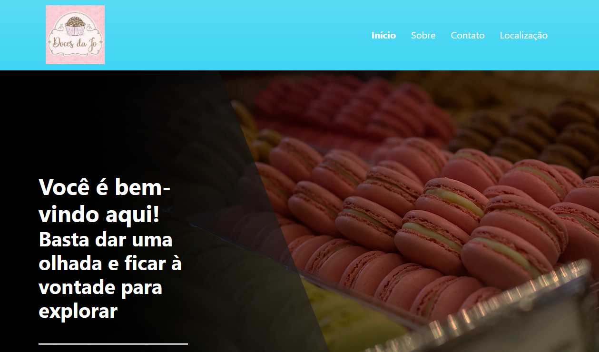

<h1 align="center">
 
    DOCES DA JO

</h1>

Loja de doces online projetada para um pequeno empresário

  

## Features
Abaixo estão todos os recursos usados ​​neste projeto:

- **HTML5** — Standard markup language
- **Bootstrap** — Stylization framework
- **PHP8** — Interpreted language

 

## Getting started

Você pode clonar e usar o repositório a qualquer momento
Se você não se lembra como, siga este link oficial do GitHub abaixo para obter o documento:
https://docs.github.com/pt/github/creating-cloning-and-archiving-repositories/cloning-a-repository-from-github/cloning-a-repository

 

## About me

Estudante de Tecnologias em Sistemas para Internet, na UniCesumar - PR
 
RA: 20005167-5
 
Github: https://github.com/JhonnyRamos

## License

This project is licensed under the MIT License - see the [LICENSE](https://opensource.org/licenses/MIT) page for details.
